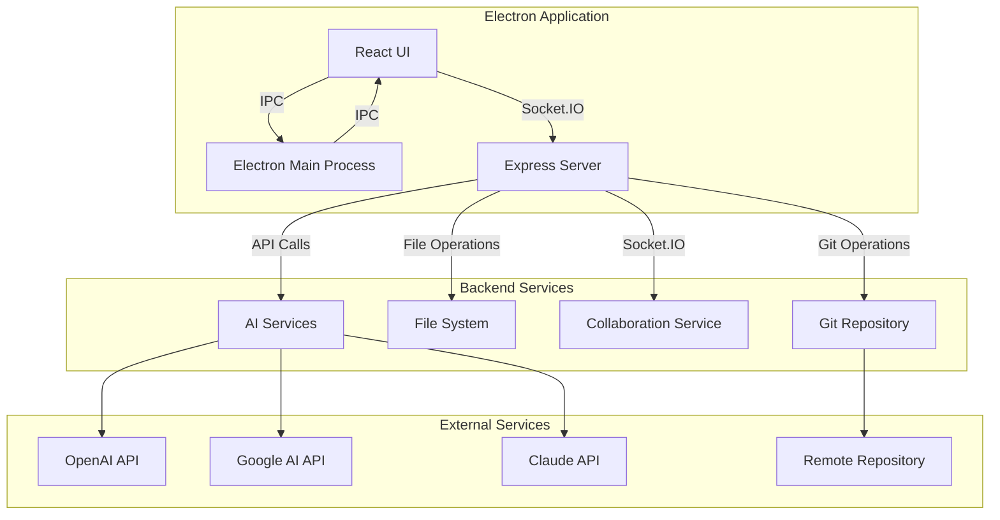

# System Dataflow

This document outlines the data flow and system architecture of Mega IDE.

## System Architecture Diagram

## Data Flow Breakdown

### 1. Frontend to Backend Communication

#### A. Socket.IO Events
- **File Operations**
  - Client emits file read/write requests
  - Server processes file system operations
  - Server broadcasts file changes to connected clients

- **Git Operations**
  - Client emits git commands (clone, commit, push, etc.)
  - Server executes git operations via simple-git
  - Server sends operation results back to client

- **Real-time Collaboration**
  - Changes are broadcast to all connected clients
  - Cursor positions and selections are synced
  - File updates are synchronized in real-time

#### B. IPC (Inter-Process Communication)
- Communication between Electron main process and renderer
- File system access through secure channels
- Native system integration

### 2. Backend Services

#### A. Express Server (Port 3000)
- Handles HTTP requests
- Serves static files
- Manages Socket.IO connections
- Coordinates between services

#### B. Collaboration Service (Port 4000)
- Manages shared editing sessions
- Synchronizes document states
- Handles user presence

#### C. File System Operations
- File reading/writing
- Directory management
- Project structure maintenance
- ZIP file creation

#### D. Git Integration
- Repository management
- Commit handling
- Branch operations
- Remote synchronization

### 3. External Service Integration

#### A. AI Services
- Code analysis requests
- Suggestions and improvements
- Documentation generation
- Error detection

#### B. Version Control
- Remote repository synchronization
- Branch management
- Commit history

## State Management

### 1. Frontend State
- React component state
- File tree structure
- Editor content
- Git status
- User preferences

### 2. Backend State
- Active connections
- File system cache
- Git repository status
- Collaboration sessions

## Error Handling

### 1. Frontend
- UI error boundaries
- Socket connection retry logic
- IPC error handling

### 2. Backend
- File system error handling
- Git operation error management
- Socket connection error recovery
- API error handling

## Security Considerations

### 1. File Access
- Sandboxed file system operations
- Restricted to project directory
- File permission checks

### 2. API Security
- Secure API key storage
- Environment variable management
- Request validation

### 3. Collaboration Security
- User authentication
- Session management
- Data validation
